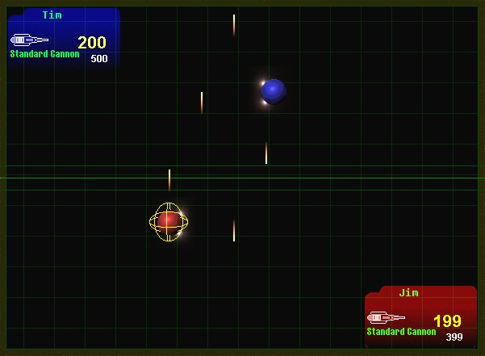



## An Awsome Game \- BotMatch \- 2 Player ROBOT WARS Game \[multiple weapons, shields, great GUI\] \*\*

### Description

BotMatch is a game I started as a school assignment last

semester, but continued to work on a little bit throughout the summer...

You and an opponent battle your BOTs out, in a quick-moving shooting arcade

style game. With an array of weapons and shields, it's a fight to the end!

I suggest seeing the game help screen (Press F1 During game-play) for

details on how to use the controls. It is made to be played on the keyboard

by both players. I am developing the AI right now in multiple difficulty

levels. Too give the game more purpose and to make it more addictive, I

will be adding many more weapons, sheilds and other BOT upgrades that the

players will be able to purchase with credits earned from their matches.

This game demonstrates the use of BitBlt, Collision Detection, Arrays, and

such tricks as how to blit text to the screen, and make fading text. Be

sure to click the Advanced Options button on the second setup form to play

with the graphics options. I hope this code helps someone, for me it has

been a great learning experience writing this. I will be getting rid of the

pictureboxes in my next version as well and using the CreateDC API to be

more efficient. Happy Coding Everyone :)
 
### More Info
 

             |
---                |---
**Submitted On**   |2001-08-14 19:36:22
**By**             |[\(Tim Miron\) yar\-interactive software](https://github.com/Planet-Source-Code/PSCIndex/blob/master/ByAuthor/tim-miron-yar-interactive-software.md)
**Level**          |Intermediate
**User Rating**    |4.8 (106 globes from 22 users)
**Compatibility**  |VB 5\.0, VB 6\.0
**Category**       |[Games](https://github.com/Planet-Source-Code/PSCIndex/blob/master/ByCategory/games__1-38.md)
**World**          |[Visual Basic](https://github.com/Planet-Source-Code/PSCIndex/blob/master/ByWorld/visual-basic.md)
**Archive File**   |[BotMatch \-25911942001\.zip](https://github.com/Planet-Source-Code/tim-miron-yar-interactive-software-an-awsome-game-botmatch-2-player-robot-wars-game-multip__1-26977/archive/master.zip)

